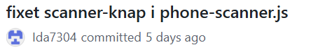
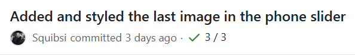
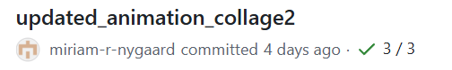

# ExD Interactive Experience Eksamen

## Museum Ovartaci - Introduktion

Dette projekt består af et produkt i form af en QR-scanner, museets gæster kan tilgå på deres mobil, til at indsamle puslespilsbrikker i form af QR-koder gemt i museets områder. Dernæst skal gæsterne kunne generere en kode som kan indtastes på en tablet, der viser hvilke brikker gæsten har fundet, og giver dem mulighed for at få mere information om Ovaratci og hans værker.

I denne fil vil der blive reflekteret og dokumenteret over hvordan der er kodet og samarbejdet gennem GitHub i løbet af projektet.
Der fremvises udvalgte stykker af koden, navngivningskonventioner, mappestruktur og validering af koden.
Dette gøres for at skabe et samlet overblik over udviklingen af produktets kode og samarbejdet herunder.

Filen inkluderer kilder og links til de anvendte modeller, dybere forklaringer og anvendt ekstern kode.


Denne fil er skrevet af **Ida Marie Møller**

---
## Kooperativt GitHub
Samarbejdet om koden er foregået via GitHub ved at tilføje gruppemedlemmer som collaborators. Dernæst har alle i gruppen cloned repository ind på deres GitHub Desktop, hvorfra der er arbejdet med push/pull requests og commits. Der er aktivt sørget for at to gruppemedlemmer ikke har arbejdet med samme fil på én gang, for at undgå at overskrive hinandens arbejde eller komme til at rette på det samme stykke kode.

Der er løbende lavet commits, med beskrivelse af hvad og hvilken fil der er ændret. Dette er gjort for det meste efter f.eks. indsættelse af en ny knap eller efter en færdiggjort funktion til et element. Dog er det også sket at der har været behov for at lave et commit for at teste produktet. Et commit har været nødvendigt, da produktet foregår over mobil og tablet-skærme og ikke en computer, så for at teste det bedste muligt, har linket fra deploy skulle bruges, hvilket først opdateres efter et commit. Dette har dog også gjort at der er mange små commits ind imellem.

### Eksempler på commits:







Som eksemplerne viser, beskrives der kort hvilke filer  og/eller hvilken funktion/område der er opdateret. På den måde skaber det et overblik i processen og gør det let at hente en ældre version af koden, skulle det være nødvendigt. Havde der opstået større fejl under udviklingen, ville dette også gøre det lettere at finde frem til hvilke filer der eventuelt kunne indeholde fejlen.

---
## Web Konventioner

### Mappestruktur
Da produktet teknisk set består af to løsninger eller to dele af 1 løsning, har det været kritisk at opdele filerne i forskellige mapper, for at kunne bevare overblikket gennem udviklingen.

For at undgå at lave 2 repositories trods de 2 løsninger, er det valgt at lave en overordnet `index.html` fil som ligger i root og en tilhørende `style.css` fil i mappen css. Dette er gjort da GitHub bruger `index.html` til at lave deployment links, som skal bruges til at fremvise produktet. Da man ikke kan have 2 `index.html` filer i samme mappe/root, er der lavet 1 overordnet som bruges til at linke til henholdsvist tablettens index og mobilens index filer. En anden løsning ville have været at lave 2 separate repositories, men grundet tidsgrænsen blev det vurderet at det var mere effektivt at beholde 1 repository til denne løsning.


Det  blev vurderet til at være mest overskueligt i dette projekt at beholde lydfiler og billeder i fælles mapper, da mange af billederne går igen på tablet og mobil og der er for få lydfiler til at det var forsvarligt at lave separate mapper
### Root
**Root består i dette projekt af:**

* .vscode (mappe)
  * settings.json

* css (mappe)
  * style.css

* img (mappe)
  * billedfiler

* phone (mappe)

* sounds (mappe)
  * lydfiler

* tablet (mappe)

* gitattributes
* index.html
* README.md

### Phone mappen
Phone mappen indeholder alle filer der er tilknyttet mobil-løsningen, med undtagelse af lydfiler og billeder, da de ligger i overordnede fællesmapper i root.

I phone mappen ligger:

* phone-css (mappe)
  * Indeholder alle phone css filer
* phone-js (mappe)
  * Indeholder alle phone js filer
* phone-scanner.html
* phone.html

Det var kun nødvendigt at bruge 2 html filer til mobil-løsningen, derfor er `phone.html` den overordnede html-fil til mobilen eller dens "index", mens `phone-scanner.html` er til selve siden der indeholder QR-scanneren.

### Tablet mappen
Tablet mappen indeholder alle filer tilknyttet tablet-løsningen med undtagelse af lydfiler og billeder, af samme årsager som phone mappen.

I tablet mappen ligger:
* js-tablet (mappe)
  * Indeholder alle tablet js filer
* tablet-css (mappe)
  * Indeholder alle tablet css filer
* collage1.html
* collage2.html
* collage3.html
* index.html
* mainpage.html
* tutorial.html

### Navngivning af mapper og filer
Mapperne følger en ens navngivningsstruktur ved at kalde dem enten hvilken løsning de indeholder (phone/tablet) eller hvilken type fil eller medie de indeholder (js/html/css/img/sounds). Det gør det let og overskueligt at finde den fil der skal arbejdes i og forhindrer forvirring over hvor hvilke filer ligger.

Mapperne bruger samme navnekonvention som filerne, her "kebab-case", det vil sige at ordene er forbundet med "-". Dette er gjort for at undgå at bruge store bogstaver og mellemrum i navngivningen, for at skabe bedre kompatibilitet, gøre det lettere at arbejde på tværs af operativsystemer, gøre URL lettere at læse og dele og for at undgå eventuelle fejl der kan opstå på tværs af systemer. Dette er også den mest anvendte og anbefalede måde at navngive filer og mapper på.


---
## Navngivning af variabler og funktioner

I JavaScript er funktioner og variabler navngivet med navngivingskonventionen "camelCase". Dette er meget standard for JavaScript funktioner og variabler, og er valgt for simpelthedens skyld. Denne navnekonvention er også brugt i HTML, for at holde det ens og overskueligt.

Derudover er funktioner og variabler navngivet med henblik på hvad de indeholder eller præcist gør.

#### **Variabel Eksempel**

Fra: `tablet-script.js` (Variable eksempel)
```
const generateBtn = document.getElementById("generateCodeButton");
const closeBtn = document.querySelector(".closeBtn");
```
Her er "generateCodeButton" fra HTML kaldt næsten det samme i JavaScript "generateBtn" og "closeBtn" fra HTML hedder det samme i JavaScript "closeBtn". Her bruges "generateBtn" til at skrive brugerens kode ind på tabletten, mens "closeBtn" bruges til at lukke overlayet fra indtastning af koden, derved er de navngivet efter hvilken funktion de udfører.

#### **Funktion Eksempel**

Fra: `phone-scanner.js`
```
function startScanner()
```
```
function onScanSuccess(decodedText)
```
Her blev der oprettet 2 funktioner. Den første `function startScanner()`, er funktionen til at starte QR-scanneren mens den anden `function onScanSuccess(decodedText)` fortæller hvad der skal ske efter en succesfuld scanning af en QR-kode.

*For dybere forklaring af hvad disse funktioner gør i koden, se:
[Prototypeovervejelser Figma Punkt 03](https://www.figma.com/design/gmecL3yCha6itCPNBn5h5N/IE?node-id=589-111&t=E35UfGNg82EtBD1y-0)*

Dette har skabt et tydeligt overblik over hvilke kode-elementer der arbejdes med i funktioner og variabler, og også tydeliggjort hvad de enekelte funktioner gør.

---

## Kode Kommentarer
Under udviklingen af projektets kode, er der løbende lavet beskrivende kommentarer i koden. Dette er gjort da ikke alle gruppemedlemmer har arbejdet i samme filer på samme tid, dog er det anvendt forskelligt alt efter typen af fil.

### <font color="orange">HTML</font>
I HTML er kommentarer anvendt som sektions-opdelere/overskrifter, der gør det hurtigt og let at finde de forskellige elementer såsom billeder eller knapper.

Eksempelvis:

Fra `tutorial.html`
```
 <!-- Video-område -->
      <div class="videoContainer">
        <!--Her kommer en video, der viser-->
        <div class="videoPlaceholder">🎥Videovejledning kommer snart</div>
      </div>
```

Fra `phone.html`
```
 <!-- Overskrift -->
        <h1>Velkommen til <br> Museum Ovartaci</h1>

        <!-- Knapper -->
        <div class="content">
          <button id="helpBtn">Hjælp mig i gang</button>
          <a id="triedBeforeBtn" href="phone-scanner.html">Jeg har prøvet før</a>
        </div>
```
---
### <font color="dodgerblue">CSS</font>
I CSS er kommentarer også brugt til at opdele koden i sektioner, samt kort at bemærke hvad stykker af koden gør. Her er det også brugt til overskrifter, før hver blok af styling.

Eksempelvis:

Fra `collage2-style.css`
```
/* --------------------------------------------------------------------------------------------------------
Animation - overgangs animation
-------------------------------------------------------------------------------------------------------- */
/* Reveal-lag – dækker hele skærmen */
.reveal-layer {
  position: fixed;
  top: 0;
  left: 0;
  width: 100%;
  height: 100%;
  pointer-events: none; /* så klik kan gå igennem til figurerne */
  overflow: hidden;
}
```

Fra `phone-scanner.css`
```
/* Styling til den nederste brik (gul) */
#bottomBrainPiece {
    /* Gør at brikken kan ligge ovenpå billedet nedenunder */
    position: absolute;
    z-index: 2;
    width: 116px;
    top: 73%;
    left: 49.5%;
    transform: translate(-50%, -50%);
}
```
---
### <font color="yellow">JavaScript</font>
I JavaScript er kommentarer anvendt lidt anderledes. De er brugt til at lave sektioner i koden, men også oftere brugt til hver enkelte linje kode for at gøre det lettere at navigere og for at alle gruppemedlemmer forstår hvad koden gør. Det har skabt et overblik over kodens funktion, selv hvis det er et andet gruppemedlem der har skrevet den. 

Eksempelvis:

Fra `tablet-script.js`
```
//slide animation
// Her manipuleres css-egenskaber direkte i js.
// transform: translateX(-100%) flytter elementet 100% til venstre
function slideTo(index) {
  track.style.transform = `translateX(-${index * 100}%)`;
  currentIndex = index;
}
```
Fra `phonescript.js`
```
// Funktion til "næste"-knappen
nextBtn.addEventListener("click", () => {
    // Her tjekker vi om currentStep er mindre end længden på arrayet med steps.
    // Hvis true -> gå til næste step, hvis false -> link til puslespilssiden.
    if (currentStep < instructions.length - 1) {
        currentStep++;
        renderSteps();
    } else {
        window.location.href = "phone-scanner.html";
    }
});
```
Denne måde at skrive kommentarer på gør projektet mere overskueligt, og sikrer at alle forstår og kan læse koden.

---
## ORCA og Data-mapping
I projektet er der arbejdet med OOUX og ORCA.
OOUX står for:
* Object
* Oriented
* User
* Experience

og bruges til at hjælpe med designe digitale løsninger der matcher brugerens mentale model.
Det vil sige "hvorfor og hvordan". Det er tilgangen til projektet.

ORCA står for:

* O - Object
* R - Relationships
* C - Call-To-Action
* A - Attributes

og er værktøjet der hjælper med at bryde OOUX ned i konkrete trin. Det vil sige "hvordan hænger det sammen"?

Grundet at der i dette projekt er udviklet løsninger både til mobil og tablet, er der også anvendt 2 ORCA-modeller til henholdsvis hver løsning. Disse modeller kan ses på følgende link:

**Link til ORCA-modellen:** [ORCA-model Figma Punkt 05](https://www.figma.com/design/gmecL3yCha6itCPNBn5h5N/IE?node-id=600-275&t=ZBFfFt5StLVBmW8T-0) 

Det skal dog bemærkes, at til projektet er det vurderet at "Objects" og "Attributes" har været de centrale punkter at identificere i ORCA-modellen. Det er forsøgt så vidt muligt at identificere "Call-to-action" og "Relationer", dog er det ikke ved alle objekter at disse punkter er udfyldt.

#### **Sammenhængen mellem ORCA-modellen og JavaScript**

Et eksempel på hvordan ORCA-modellen og JavaScript hænger sammen med fokus på **Objects** og **Attributes**:

Fra `collage2-script.js`

Objekt
```
const figure1 = document.getElementById("figure1Hitboks");
```
Attributes
```
const painting1Audio = new Audio("../sounds/lyd-til-painting1.m4a");

const overlay1 = document.getElementById("hiddenFigure1");

overlay1.style.display = "flex";

overlay1.style.display = "none";
```
#### **Object**
I ORCA-modellen til tabletten er der lavet et objekt kaldet "klik-bar figur". I `collage2-script.js` er dette skrevet som variabler med navnene `figure1, figure2 og figure3`, det vil sige at alle `figureX og figureXHitboks` refererer til "klik-bar figur" objektet i ORCA-modellen.

#### **Attributes**
I ORCA-modellen er objektet "klik-bar figur" givet følgende attributes:
* id
* position
* reference til kunstværk
* boolean (aktiv/ikke-aktiv)

I JavaScript er dette gjort ved at:
* Objektet har id'et `figure1Hitboks`, som det er tildelt i HTML.
* Dens position på skærmen er tilpasset i CSS.
* Variablerne `paintingAudio1` refererer til lyd som giver information om Ovartaci og `overlay1` bruges til at vise pop-op vinduet som indeholder det givne kunstværk, altså refererer disse to variabler til kunstværket.
* "Boolean" bruges typisk til if/else, men her styres det med `overlay1.style.display = "block`, som viser **objektet** og `overlay1.style.display = "none"`, som skjuler **objektet**.

Dette er blot et eksempel på hvordan ORCA-modellen kan hjælpe med at skabe JS-struktur ved at indentificere **objekter** løsningen består af og hvad disse **objekter** skal indeholde (**attributes**).<br> ORCA-modellen blev lavet før kodning og fungerer derfor mest som et designgrundlag/overblik over **objekter** og deres **attributter**. Under implementeringen er der sket ændringer, så modellen og koden er ikke helt 1:1, dog er der stadig taget udgangspunkt i ORCA-modellen.

---
## JS Data Struktur
Til dette projekt er JS data organisret med arrays og object-literal. Da objekterne i koden er nogle gruppen selv har oprette gav det ikke mening at anvende eksterne JSON-filer.

#### Arrays
Til mobil-løsningen er det valgt at lave introduktionsslides, også kaldet onboarding, der forklarer brugeren hvordan produktet fungerer. <br>
Dette er gjort ved at oprette et array der indeholder instruktionerne brugeren skal bruge samt en visualisering i form af et billede.

```
const instructions = [
    {
      text: "Find QR-koderne rundt omkring i museets områder",
      img: "../img/qr-code-img.png"  
    },
    {
      text: "Start scanneren og scan QR-koderne",
      img: "../img/qr-code-img.png"  
    },
    {
      text: "Saml de forskellige områder på museet",
      img: "../img/full-empty-brain.svg"
    },
    {
      text: "Generér din kode og tast den ind på tabletten til sidst, som vist her",
      img: "../img/skriv-koden.svg"
    }
];
```

**Funktion** <br>
Arrayet `instructions` indeholder 4 objekter med hver deres properties her `text` og `img` som begge har en string-value i form af tekst og filstier til billeder. Når arrayet bruges i koden, hentes objekterne via deres index i arrayet. Det er vigtigt at notere at arrays er 0-indekserede, det vil sige at objekterne har rækkefølgen: 0, 1, 2, 3 og ikke 1, 2, 3, 4. Det har betydning for hvordan `currentStep` bruges til at bestemme hvilket step brugeren er på. <br>
Array er anvendt her, da instruktionsslides (onboarding) skal vises i en bestemt rækkefølge, hvilket bedst gøres med arrays.

**Datatyper** <br>
I arrayet er datatyperne således:
* **{ }** = et objekt i arrayet
* **Alt indenfor " "** = values som her er strings (string-values)

#### Object-literal
Udover array er der anvendt object-literal til QR-scanner funktionen.

```
const puzzleData = {
    puzzle1: `Scanning gennemført! <br> Du har fundet: 
            <br> 
            <h2>Identitet!</h2> <br>
            `,

    puzzle2: `Scanning gennemført! <br> Du har fundet: 
            <br> <h2>Fantasi, Drømme <br> og Visioner!</h2> <br>
            `,

    puzzle3: `Scanning gennemført! <br> Du har fundet: 
            <br> <h2>Normalitet!</h2> <br>
            `
};
```
Dette er gjort fordi disse data er nøglebaseret (key-values) og ikke en liste som et array.<br> QR-koderne er oprettet med f.eks. teksten "**puzzle1**" i en online QR-kode generator: [QR-code generator](https://qr.io/). Det betyder at når brugeren scanner QR-koden, læser koden "**puzzle1**" som er denne QR-kodes ID. <br> At det ligger som et object-literal, gør at der kan slås direkte op i objektet, som giver adgang til den rigtige pusplespilsbrik. Et array ville her være upraktisk, da QR-id'erne så ville skulle oversættes til index-tal, hvor med object-literal kan ID'erne tilgås direkte, hvilket i dette tilfælde fungerede bedre.

**Funktion** <br>
`const puzzleData` er et objekt som bruger QR-kodernes ID'er (puzzle1, puzzle2 og puzzle3) som keys. Hver af disse keys har en string-value (template literals) som indeholder det indhold der skal vises for brugeren når den tilsvarende QR-kode scannes, her tekst og billeder.<br>
Dette sikrer desuden at kun QR-koder med ID'er der matcher keys fra `puzzleData`, kan registreres og scannes, hvilket forhindrer brugeren i at scanne en tilfældig QR-kode med scanneren fra dette projekt. 

**Datatyper** <br>
I ovenstående eksempel er datatyperne således:
* **puzzle1, puzzle2, puzzle3** = keys, men de betragtes som **strings**, derfor er de ofte kaldet **string-keys**.
* **Alt skrevet i " `` (backtics) "** = values, som her er strings/template literal.

---
## Kode Highlights (herunder brug af localStorage)

I følgende afsnit vil der blive gennemgået kodestykker fra HTML, CSS og JavaScript, med fokus på anvendelsen af localStorage i dette projekt. Der opdeles efter mobil og tablet løsningen.

Overordnet bruges localStorage i dette projekt til at gemme hvilke puslespilsbrikker brugeren har fundet på museet. Det gemmer deres fremskridt, så de kan fortsætte med at indsamle koder, senere eller på et nyt besøg. Det er dog valgt at give dem muligheden for at starte forfra ved at "tømme" localStorage, dette forklares senere.


### Brug af localStorage til tablet (HTML, CSS og JS)

**Følgende er fra filerne:** `index.html`(i tablet mappen), `tablet-style.css`, `mainpage-script.js` og `tablet-script.js`.

**<font color="orange">HTML</font>**

`index.html`(i tablet mappen)

Til pop-op vinduet der indeholder knappen der bruges til localStorage skal følgende HTML elementer hentes:
* **overlayCode**, som er div'en der indeholder pop-op vinduet hvor brugeren kan indtaste deres kode fra deres mobil.
* **generateCodeBtn**, som er "skriv kode"-knappen der skal åbne pop-op vinduet når brugeren klikker på den.
* **closeBtn**, som skal lukke pop-op vinduet når brugeren klikker på den.
* **codeAcceptBtn**, som er "Godkend"-knappen der bruges til at gemme brugerens kode i localStorage.
* **codeHowItWorksBtn**, som åbner en ny side med en forklaring til brugeren om hvordan produktet fungerer.
* **codeInput**, som er feltet hvor brugeren kan indtaste sin kode.

Til forklaring af localStorage er det hovedsagligt `codeInput` og `codeAcceptBtn` der skal anvendes.

`codeInput` er indsat som `<input type="text" id="codeInput" placeholder="_ _ _ _">`.
* Input, laver et felt som brugeren kan skrive i, her et tekstfelt da type="text".
* Id giver feltet id'et "codeInput", som bruges til at tilgå tekstfeltet med JavaScript og CSS.
* Placeholder viser "_ _ _ _" når brugeren åbner pop-op vinduet men før de har skrevet i feltet.

`codeAcceptBtn` er indsat som `<button id="codeAcceptBtn">Godkend</button>`.
* Button laver en knap.
* Id'et giver button-tagget id'et "codeAcceptBtn".
* Mellem >< skrives teksten der skal stå på knappen, her "Godkend".

**<font color="dodgerblue">CSS</font>**

`tablet-style.css`

Til styling af `codeInput` og `codeAcceptBtn` er følgende kode anvendt:

**Styling af `codeInput`**

```
#codeInput {
  width: 90%;
  padding: 1rem;
  margin: 1rem 0;
  font-size: 1.2rem;
  text-align: center;
  border: 2px solid #ccc;
  border-radius: 2rem;
  font-family: inherit;
}
```
* width gør at feltet fylder 90% af pop-op vinduet.
* padding giver luft på alle indersider af tekstefeltet på 1 rem.
* margin giver luft på ydersiden af tekstfeltet med 1 rem i top og bund og 0 rem på venstre og højre side.
* font-size ændrer skriftsørrelsen i tekstfeltet til 1.2 rem.
* text-align: center centrerer teksten i tekstfeltet.
* border giver tekstfeltet en border, her på 2px bredde, den er en solid linje og har farven #ccc.
* border-radius giver her tekstefeltet afrundede hjørner på 2 rem.
* font-family: inherit, gør at tekstfeltet har samme font-family som dens parent. Den sidste parent her med en defineret font-family er "body", som har font-family "Bebas Neue", sans-serif.


**Styling af `codeAcceptBtn`**

```
.codeButtons button {
  background-color: #52805a;
  color: white;
  border: none;
  padding: 8px 20px;
  margin: 5px;
  border-radius: 40px;
  font-family: "Inter", sans-serif;
  font-size: 0.9rem;
}
```
`codeAcceptBtn` er stylet under klassen `codeButtons` hvor der direkte tilgås alle button tags under denne klasse med `button`.

* background-color sætter baggrundsfarven til #52805a.
* color: white, gør tekst på knappen hvid.
* border: none, fjerner border fra knappen.
* padding giver her lust på indersiden af knappen med 8px i top og bund og 20px i venstre og højre side.
* margin giver luft på ydersiden af knappen, her med 5px.
* border-radius giver knappen afrundede hjørner, her med 40 px.
* font-family giver teksten på knappen dens font, her "Inter", sans-serif.
* font-size angiver størrelsen på teksten, her 0.9 rem. 

**<font color="yellow">JavaScript</font>**

I tablettens JavaScripts er der 2 filer der anvender localStorage:

`tablet-script.js` og `mainpage-script.js`

da det er her brugeren skal kunne tilgå de puslespilsbrikker de har fundet undervejs i museet.

**Tablet-script.js filen**

Her bliver localStorage anvendt i:

```
if (codeAcceptBtn) {
  codeAcceptBtn.addEventListener("click", () => {
    const Code = codeInput.value.trim();
    if (Code === "") {
      alert("Indtast venligst en kode.");
      return;
    }
    // Split koden ved "-" for at få array af brik-id'er (f.eks. "1-2-3" -> ["1","2","3"])
    const pieces = Code.split("-");
    // Valider at alle elementer er "1", "2" eller "3" (eller andre gyldige id'er)
    const valid = pieces.every((id) => id === "1" || id === "2" || id === "3");
    if (!valid || pieces.length === 0) {
      alert(
        "Ugyldig kode. Koden består af tal adskilt af bindestreg, f.eks. 1-2-3",
      );
      return;
    }
    // Gem koden i localStorage
    localStorage.setItem("FoundPieces", JSON.stringify(pieces));
    // Omdiriger til mainpage (justér stien efter dit projekt)
    window.location.href = "../tablet/mainpage.html";
    // console
    console.log("Gemmer i localStorage:", JSON.stringify(pieces));
  });
}


```

Kort forklaret starter koden med at tjekke om `codeAcceptBtn` ("Godkend"-knappen) eksisterer i JavaScript, gør den det, kører den koden. Der tilføjes en `click-event` til `codeAcceptBtn`, som køres når brugeren klikker på "Godkend"-knappen. I `click-eventet` gemmes brugerens indtastede kode fra `codeInput` i en variabel kaldet `code`. Her tilføjes `trim()` for at fjerne eventuelle mellemrum, som brugeren kunne have indtastet ved et uheld, der kunne skabe fejl. Hvis `code` er tom (" "), får brugeren en besked om at de mangler at indtaste en kode, og funktionen stoppes ved `return`.

Som det næste deles den indtastede kode op ved brug af `split("-")` som omdanner brugerens kode fra tekst til et array af brik id'er f.eks. bliver "1-2-3" til ["1", "2", "3"], som gemmes i variablen `pieces`. Hernæst valideres arrayet ved brug af `.every()`, som tjekker om alle elementer i et array opfylder en bestemt betingelse. Her er betingelsen at id'erne skal være enten "1", "2" eller "3". Er de ikke det eller hvis `pieces` arrayets længde er lig 0, får brugeren en besked om at koden er ugyldig og funktionen stoppes med `return`.

Har brugeren tastet en gyldig kode, gemmes denne kode, det vil sige de puslespilsbrikker de har fundet, i localStorage med `localStorage.setItem` under nøglenavnet `FoundPieces`. `JSON.stringify(pieces)` bruges til at konvertere arrayet `pieces` som indeholder brikkernes id'er, til en tekst-string, da localStorage kun kan læse tekst.

Til sidst omdirigeres brugeren til næste side med `window.location.href = "../tablet/mainpage.html";`, som her er siden der viser hvilke brikker brugeren har fundet, hvor de kan fortsætte deres udforskning af produktet.


**Mainpage-script.js filen**

Her bliver localStorage anvendt i:
```
function getFoundPieces() {
  const saved = localStorage.getItem("FoundPieces");
  if (saved) {
    return JSON.parse(saved);
  }
  return []; // ingen brikker fundet endnu
}

function saveFoundPieces(pieces) {
  localStorage.setItem("FoundPieces", JSON.stringify(pieces));
}
```
og
```
function resetPuzzle() {
  localStorage.removeItem("FoundPieces");
  updatePuzzle();
  console.log("Spillet er nulstillet");
}
```

Det første stykke kode bruges til at hente puslespilsbrikkerne som ligger gemt i localStorage, mens i det sidste bruges localStorage til at resette den indtastede kode, så næste bruger kan komme til. Brikkerne er gemt via den indtastede kode brugeren har skrevet, som forklaret i sidste afsnit.

I det første stykke oprettes en konstant variabel `saved`, som henter brikkernes ID'er fra `localStorage`. Der tjekkes om der er data i `localStorage` med `if (saved)`. Er der det, bliver dette statement true, og data returneres som et array med `JSON.parse(saved)`. Er `localStorage` tomt, returneres et tomt array med `return []`. <br> Funktionen `saveFoundPieces(pieces)`, bruges til at gemme arrayet med brikkernes ID'er i `localStorage`, ved hjælp af `localStorage.setItem()`, så oplysningerne kan hentes igen senere. Arrayet bliver igen lavet til string med `JSON.stringify(pieces)`, da `localStorage` kun kan læse tekst.

I det sidste stykke oprettes funktionen `resetPuzzle()`, som bruges til at slette de gemte brik ID'er fra `localStorage`, så produktet er klar til næste bruger. Dette gøres ved at fjerne brikkernes ID'er fra localStorage med `localStorage.removeItem("FoundPieces)`. Dernæst kaldes funktionen `updatePuzzle`, som opdaterer puslespillets visning.


### Brug af localStorage til mobil (HTML, CSS og JS)

**Følgende er fra filen `phone-scanner.js`.**

**<font color="yellow">JavaScript</font>**

Her bliver localStorage brugt i:

```
// Funktion til localStorage
function getFoundPieces() {
    // Henter "FoundPieces" fra localStorage og gemmer det i const "saved"
    const saved = localStorage.getItem("FoundPieces");

    // Hvis der findes data i "saved", konvereteres JSON til array/objekt og returneres.
    if(saved) {
        return JSON.parse(saved);
    }
    // Hvis der ikke findes data i "saved", returneres et tomt array.
    return [];
}

// Gemmer brikkerne i localStorage.
function saveFoundPieces(pieces) {
    localStorage.setItem("FoundPieces", JSON.stringify(pieces));
}
```
og
```
function resetPuzzle(){
    localStorage.removeItem("FoundPieces");
    // Kører funktionen renderPuzzle igen, efter localStorage er tømt.
    // Nu findes brikkerne ikke i localStorage længere så brikkerne bliver hvide og process teksten opdateres til 0. 
    renderPuzzle();
}
```

I `phone-scanner.js` bruges `localStorage` til at gemme brik-ID'erne, så det gemmes når brugerne har scannet en QR-kode, på samme måde som det bruges til at gemme brik-ID'erne i `mainpage-script.js` som beskrevet før. Den eneste forskel er at `function resetPuzzle()` ikke kalder på `updatePuzzle()` funktionen men i stedet `renderPuzzle()`, som er den funktion der styrer visningen af puslespillet på mobilen.

*For dybere forklaring af hvordan localStorage gemmer brikkerne i et array og viser de korrekte brikker på skærmen se: [Prototypeovervejelser Figma Punkt 07](https://www.figma.com/design/gmecL3yCha6itCPNBn5h5N/IE?node-id=654-162&t=luw8YoITCG5hLTmF-0)*


---
## JS Biblioteker

Til projektet er der anvendt eksterne JS-filer, som er dokumenteret her.

### html5-qrcode

Dette bibliotek er brugt i projektets QR-scanner funktion. Det er anvendt til at kunne tilgå brugerens mobil-kamera, med tilladelse fra brugeren, for at kunne scanne QR-koder.

**GitHub Kilde:** [html5-qrcode GitHub](https://github.com/mebjas/html5-qrcode?utm)

**CDN brugt i dette projekt:** [CDN html5-qrcode](https://unpkg.com/html5-qrcode@2.3.8/html5-qrcode.min.js)

### Google Fonts

Dette er brugt til at impotere fonts ind i koden til projektet.


**Kilde:** [Google Fonts](https://fonts.google.com/)

**Link til fonts anvendt i dette projekt:** [Bebas Neue og Inter fonts](https://fonts.googleapis.com/css2?family=Bebas+Neue&family=Inria+Sans:ital,wght@0,300;0,400;0,700;1,300;1,400;1,700&family=Inter:ital,opsz,wght@0,14..32,100..900;1,14..32,100..900&family=Nunito+Sans:ital,opsz,wght@0,6..12,200..1000;1,6..12,200..1000&display=swap)

---
## Validering af kode
Som afslutning af kodningsprocessen er koden kørt gennem valideringsværktøjer, for at sikre at der ikke er opstået fejl i koden som ikke er blevet bemærket undervejs. Det skal dog noteres at kun **HTML** og **CSS** kan valideres med disse værktøjer. **JavaScript** er i stedet kontrolleret løbende i processen, ved at tjekke console i Live Serveren.

**Til validering er følgende sider brugt:**

Validering af **HTML** : [Markup Validation Service](https://validator.w3.org/).

Validering af **CSS** : [CSS Validation Service](https://jigsaw.w3.org/css-validator/)

### Eksempel på validering


*Denne validering er af den overordnede `index.html` fil som findes i root.*

### Beviser på validering

Alle **HTML** og **CSS** filer er valideret i slutningen af projektet. Beviser for dette samt forklaring af eventuelle warnings kan ses i følgende fil: 
[Prototypeovervejeler Figma Punkt 09](https://www.figma.com/design/gmecL3yCha6itCPNBn5h5N/IE?node-id=546-384&t=AiFRWWNF4wF68HR9-0)


## Afrunding

Denne fil har skabt et tydeligt og struktureret overblik over samarbejdet under kodning, udvalgte kodestykker med fokus på localStorage, anvendelse af relevante modeller og hvordan gruppen har sikret forståelse og læsbarhed af koden gennem projektet.